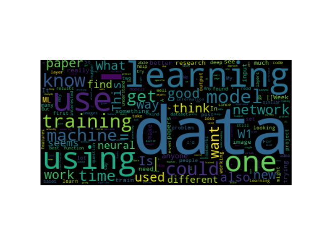

# redditCloud
**A wordcloud generator for subreddits. Visualize frequency of word appearances!**

**/r/machinelearning wordcloud**

</img>

**What does each script do?**

- subreddit_scraper.py to scrape submissions to a subreddit between specified dates.

- word_cloud.py to generate the wordcloud.

- nltk_download.py to download corpus of unecessary words.

**How do I execute?**

python3 nltk_download.py

python3 subreddit_scraper.py subreddit start end

python3 word_cloud.py subreddit-data.csv

- subreddit is any subreddit name
- start and end are specified as an epoch time stamp (if no args passed defaults to year of 2017)
**- REMEMBER TO: Add your credentials for authenticating with Reddit API to subreddit_scraper**

